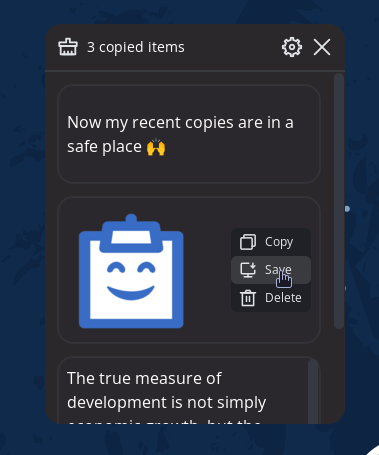

<!-- markdownlint-configure-file {
  "MD013": {
    "code_blocks": false,
    "tables": false
  },
  "MD033": false,
  "MD041": false
} -->
# Cliptron

<div align="left">

A tiny cross-platform app that lets you manage your clipboard history with ease 📋⏱️🍰



<ul>
    <li>
        <strong>Remembers text & images that you copy 📋</strong> <br />
      An awesome feature with cliptron is that it remembers all kind of copies, no matter if it is a text or an image.
    </li>
    <li>
        <strong>Save what you copied to individual files ⬇️</strong> <br /> You can save what you copy locally inside a text/image files in the format that you choose!
    </li>
    <li>
        <strong>Dark/Light Theme support 🌕🌞</strong><br />  If you don't care about your eyes.
       </li>
    <li>
        <strong>Choose your shortcut key #️⃣</strong><br />  Assign a shortcut for calling your clipboard history.
    </li>
</ul>

## Installation
Check the [Release section](https://github.com/fayez-nazzal/Cliptron/releases) for getting pre-built packages for your operating system.

- For **Linux**, a debian `.deb` package and an `AppImage` is available. If you prefer using AppImages, note that this app, by default is configured to run on your OS startup, with that enabled, you can either keep your AppImage in a fixed place or use an integration tool like [AppImage Launcher](https://github.com/TheAssassin/AppImageLauncher).

- For **MacOS**, there's a `.dmg` Image file availale in the release section.

- For **Windows**, an installer package `.msi` is available.

### Linux - i3wm users
You can call this app with your custom shortcut right away, no additional configuration required (no need for floating window configs).

## Build From Source
### Build Requirements
- [Rust](https://www.rust-lang.org/).
- [Node.js](https://nodejs.org/en/).
- For Windows users, you would need [Microsoft Visual Studio C++ Build Tools](https://visualstudio.microsoft.com/visual-cpp-build-tools/).
- For Linux users, make sure to install the following dependencies.
```bash
$ sudo apt update
$ sudo apt install libwebkit2gtk-4.0-dev build-essential curl wget libssl-dev libgtk-3-dev libayatana-appindicator3-dev librsvg2-dev
 ```

### Building

1. Clone this repo in a directory of your choice:
```console
  git clone https://github.com/fayez-nazzal/Cliptron/edit/master cliptron
```

2. Enter the cloned directory:
```console
  cd cliptron
```

3. Run the following commands to start the build process:
```console
npm run build
npm run tauri build
```

4. You will find resulting binaries in `cliptron/src-tauri/targer/release`.

## Techs used
This project is written entirely using [Rust](https://www.rust-lang.org/) & [Next.js](https://vercel.com/solutions/nextjs) by using the power of the awesome [Tauri Toolkit](https://tauri.app/).

## Contributors
<a href = "https://github.com/fayez-nazzal/cliptron/graphs/contributors">
  
</a>

## TODO List
- Auto Paste feature.
- Global shortcut without a requirement to hide the window.
- For MacOS, Global shortcuts without keeping the window icon on the dock.

## Contribution
You are welcome to join 👋

## License
This product is licensed under MIT License.
</div>
